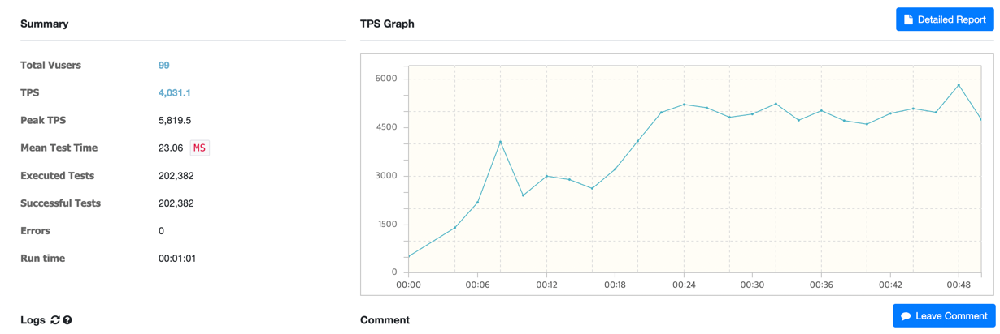
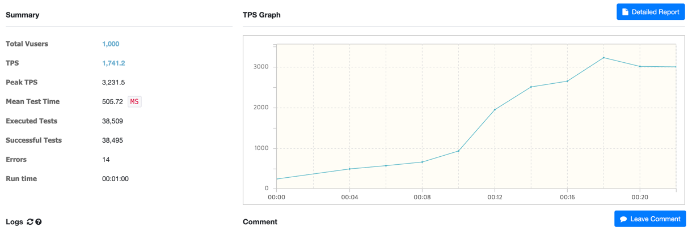
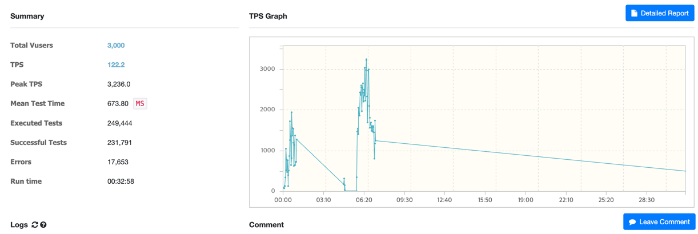

# 🎟️ 쿠폰 사전 생성 및 실시간 발급 시스템

> 이벤트 시작 전 미리 쿠폰을 생성하고, 실시간 발급 요청 시 Redis 기반으로 빠르게 발급 처리하는 고성능 비동기 발급 시스템
>

---

## 📌 주요 목적

- 이벤트 트래픽 폭주 대비 **사전 쿠폰 발급 준비**
- Redis 기반의 **빠른 쿠폰 발급 처리**
- Kafka + DB 기반의 **비동기 저장 처리로 안정성 확보**
- **중복 발급 방지, 발급 이력 관리** 포함

---

## 🧱 시스템 구성도

```
[Admin API] ──▶ [PreLoadCouponService] ──▶ [DB + Redis 쿠폰 생성]
                                 ↓
                          Redis 쿠폰 LIST (셔플된 순서로 적재)
                                 ↑
[User 발급 요청] ──▶ [Redis Lua Script + Kafka] ──▶ [DB 쿠폰 발급 처리]
```

## 1. 사전 생성 (Preloading)

### 🔧 API: `/coupons/preload`

### 🔁 주요 흐름

1. **쿠폰 그룹 생성**
2. **할인 정책 저장 (정률/정액)**
    - `CouponPolicyDetail`에 `discountType`, `discountAmount`, `allocationPercentage` 저장
3. **할당 비율에 따라 쿠폰 생성**
4. **쿠폰 리스트를 섞어(shuffle) Redis List 형태로 저장**
    - Redis 키: `couponQueue:{eventId}`
    - Redis 값 예시: `"ABC123:50"` (`couponKey:discountAmount`)
    - `discountAmount`값 저장해서 발급됐을 때 바로 발급된 값 리턴
5. **DB에 쿠폰도 저장 (미발급 상태)**

### ✅ Redis에 적재

```kotlin
redisTemplate.opsForList().rightPush(key, "${c.couponKey}:${c.discountAmount}")
```

---

## 2. 발급 요청 처리

### 🔧 API: `/coupons/issue`

### 📜 Redis Lua Script 로직

```lua
-- KEYS[1] = 쿠폰 큐 (List)
-- KEYS[2] = 발급 내역 저장 Hash
-- ARGV[1] = 유저 ID

local queueKey = KEYS[1]
local issuedKey = KEYS[2]
local userId = ARGV[1]

-- 이미 발급받은 사용자 확인
if redis.call("HEXISTS", issuedKey, userId) == 1 then
  return "DUPLICATE"
end

-- 쿠폰 큐에서 꺼내기
local couponKey = redis.call("LPOP", queueKey)
if not couponKey then
  return "SOLD_OUT"
end

-- 발급 내역 기록
local data = cjson.encode({
  couponKey = couponKey,
  userId = userId,
  issuedAt = tostring(redis.call("TIME")[1]),
  status = "PENDING"
})
redis.call("HSET", issuedKey, userId, data)

return couponKey

```

### ✅ 사용 Redis 키

| 키 이름 | 설명 | 자료구조 |
| --- | --- | --- |
| `couponQueue:{eventId}` | 셔플된 쿠폰 발급 큐 | List |
| `couponIssued:{eventId}` | 발급된 유저 이력 | Hash |

---

## 3. Kafka Consumer

### 🎯 발급 이벤트 처리 (`coupon-issued` 토픽)

- 쿠폰 DB에서 `couponKey` 조회
- `issued = true`, `userId` 설정
- `discountAmount`, `discountType`도 저장
- DB 업데이트로 발급 상태 반영

---

## 💡 기술 스택

| 구분 | 기술 |
| --- | --- |
| Message Queue | Apache Kafka |
| DB | RDB (JPA + Kotlin) |
| Cache | Redis (LIST + HASH, Lua Script 사용) |
| 프레임워크 | Spring Boot |
| 테스트 도구 | nGrinder (성능 테스트) |

---

## ⚙️ 설계 포인트

- `Redis + Lua Script` 조합으로 **중복 발급 방지 + SoldOut 처리 + 원자성 보장**
- **사전 셔플 + Redis List** 구조로 순차적이지만 무작위성 있는 발급 가능
- **발급 이벤트는 Kafka로 분리**하여 DB 트랜잭션과 분리, 시스템 안정성 향상
- 포트/어댑터 구조(Facade/Hexagonal Architecture) 기반으로 유연한 확장 가능


---

## ⚙️ nGrinder 테스트 결과 
### VUser 99

### VUser 1000

### VUser 3000
